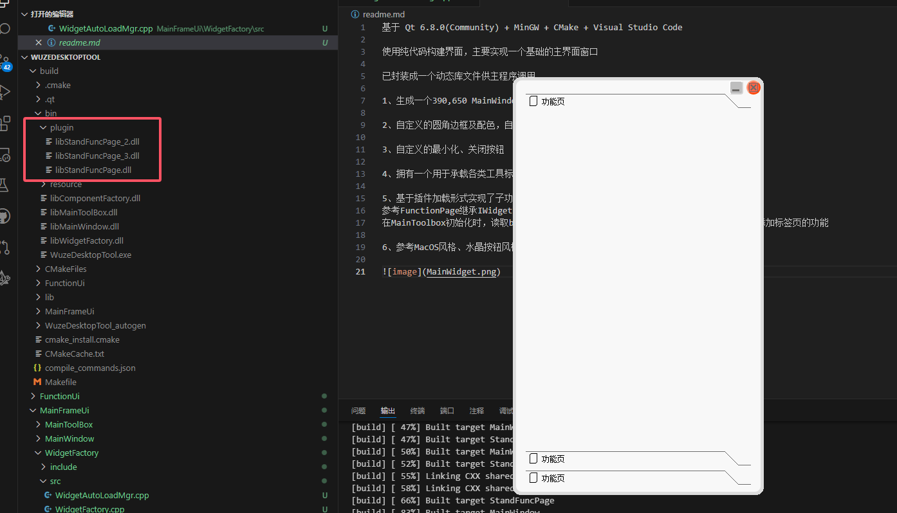

基于 Qt 6.8.0(Community) + MinGW + CMake + Visual Studio Code

使用纯代码构建界面，实现一个基础的桌面应用框架

1、生成一个390,650 主界面，移除菜单栏、标题栏等默认元素

2、自定义的圆角边框及配色，自带实现等比例缩放、窗口移动等

3、自定义的最小化、关闭按钮

4、拥有一个用于承载各类工具标签页的Toolbox，点击标签页即可实现子功能页的切换

5、基于插件加载形式实现了子功能页加载，
参考FunctionPage继承IWidgetFactory对象之后，将生成的dll放置在bin/plugin文件夹下
在MainToolbox初始化时，读取bin/plugin文件夹下的动态库文件并加载，实现根据工程动态添加标签页的功能

6、参考MacOS风格、水晶按钮风格实现的组件类 CCrystalPushbutton CMacOSLineEdit等
也可以通过修改Qss文件实现样式的修改

